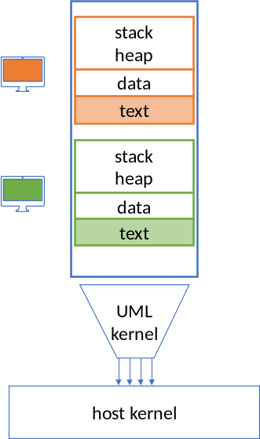

This is an experimental type of Linux Virtual Machine that does not use a hypervisor (no monitor, no emulation, no HW virtualization). A guest runs multiple processes on the same address-space as a single host process on top of 12 syscalls (sandboxed using seccomp). The guest kernel is a modified Linux configured with User-Mode-Linux (UML) and no-MMU.

# Try it with this one-liner

```
docker run --rm -it kollerr/linux-um-nommu
```
The source dockerfile is [tests/docker/linux-um-nommu/Dockerfile](https://github.com/nabla-containers/nabla-linux/blob/master/tests/docker/linux-um-nommu/Dockerfile) which uses the `alpine-test.ext3` image built
by [tests/Makefile](https://github.com/nabla-containers/nabla-linux/blob/master/tests/Makefile#L11) (which is then based on [tests/docker/alpine/Dockerfile](https://github.com/nabla-containers/nabla-linux/blob/master/tests/docker/alpine/Dockerfile)).

# Introduction

Container runtimes have been using virtualization as a way of improving isolation (e.g., Kata containers). And in order to make them feel like regular containers, the community has been trying to slim down their virtual machine (VM) monitors (e.g., Firecracker). This experimental "VM" is what happens when you slim down to the extreme: no monitor at all.

Nabla Linux is a Linux virtual machine that runs as a single unprivileged user-level process on top of only 12 syscalls. We achieve isolation equivalent to virtual machines, without using a monitor, by restricting the VM process to only these 12 system calls using seccomp. The system was built on top of a combination of two well known Linux features: user mode linux (UML) and no-MMU support (used for embedded devices) both in the kernel and in userspace (musl and busybox).



Our initial experiments show that this Linux VM is capable of running multiple unmodified binaries from Alpine (like python, nginx, redis), and can boot in 6 milliseconds (to our knowledge, this is the fastest); albeit with some limitations: PIE executables only, and no forks (processes are emulated using vforks).

# Demo:

[](https://asciinema.org/a/343173)

This shows a run with the host syscalls on the left. The point of this is to show that lots of applications just
work while running on a small set of syscalls.

# Build and test

A single `make` at the root should build linux, musl, and busybox. Then you need a disk image (think of this as a VM). You
can create a raw disk file based on alpine using the `alpine-test.ext3` target in `tests/`, or just do a `make demo` in `tests/` which
will build one and then run it.

```
make
cd tests && make demo
```

# Limitations

- No virtual memory (VM) and no memory protection. A single address space is shared by multiple processes, so a process writing into the NULL page will "kill" every process running in the VM (not what you would expect).
- No `sys_fork`. Which is partially solved by supporting `vfork` (and `posix_spawn`). The catch is that applications need to use `vfork` or `posix_spawn` instead of fork and exec (like busybox configured for NOMMU). Applications doing `sys_fork` will get an `EINVAL`. The most common usage of fork and exec (running a new program) is the shell: that's why we need busybox configured for NOMMU. Other applications like nginx or redis don't fork (haven't seen them fork at least), so they don't need to be patched.
- Can only run [PIE executables](https://en.wikipedia.org/wiki/Position-independent_code). This is the case for most of the binaries in Alpine Linux as explained [here/Secure](https://alpinelinux.org/about/).
- Have to use our modified musl libc. This libc supports making syscalls over [vsyscall](https://lwn.net/Articles/446528/) (i.e. a function call instead of the `syscall` instruction).
